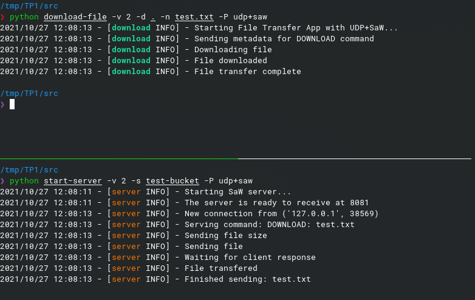
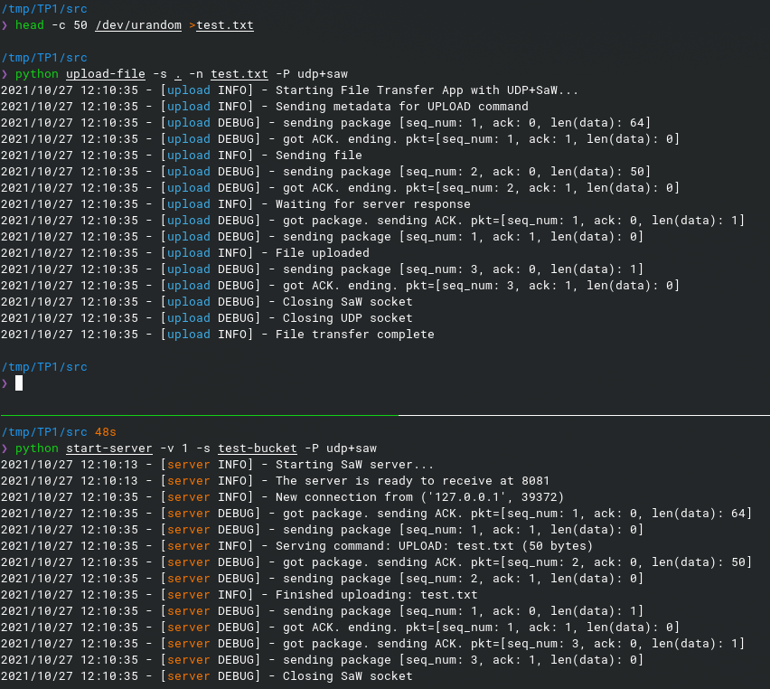
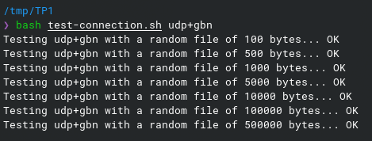

<!-- para generar el informe: pandoc informe.md -o informe.pdf -->

# Introducción

El presente trabajo práctico tiene como objetivo la creación de una aplicación de red.
Para lograr este objetivo, se deberá desarrollar una aplicación de arquitectura cliente-servidor que implemente la funcionalidad de transferencia de archivos mediante las siguientes operaciones:

- UPLOAD: Transferencia de un archivo del cliente hacia el servidor
- DOWNLOAD: Transferencia de un archivo del servidor hacia el cliente

Para tal finalidad, será necesario comprender cómo se comunican los procesos a través de la red, y cuál es el modelo de servicio que la capa de transporte le ofrece a la capa de aplicación. Como protocolo de capa de transporte, se implementa TCP y UDP.
El protocolo TCP ofrece un servicio orientado a la conexión, garantiza que los mensajes lleguen a destino y provee un mecanismo de control de flujo. Por su parte, UDP es un servicio sin conexión, no ofrece fiabilidad, ni control de flujos, ni control de congestión, es por eso que se implementa una versión utilizando el protocolo Stop & Wait y otra versión utilizando el protocolo Go-Back-N, con el objetivo de lograr una transferencia confiable al utilizar el protocolo.

# Hipótesis y suposiciones realizadas

- Por dificultad para simularlo, se asume que no llegan paquetes corruptos a la capa de aplicación.
- Puede existir una pérdida de conexión.
- Si un archivo a subir ya se encuentra en el servidor, se reemplaza su contenido.
- El archivo a descargar siempre se encuentra presente en el servidor.

# Implementación

## Cliente

La funcionalidad del cliente se divide en dos aplicaciones de línea de comandos: **upload-file** y **download-file**.

El comando `upload-file` envía un archivo al servidor para ser guardado con el nombre asignado.

`python file-upload [-h] [-v | -q] [-H ADDR] [-p PORT] [-s FILEPATH] [-n FILENAME] [-P PROTOCOL]`

Donde cada flag indica:

- `-h/--help`: Imprime el mensaje de "help"
- `-v/--verbose`: Incrementa en uno la verbosidad en cuanto al sistema de logueo del servidor
- `-q/--quiet`: Decrementa en uno la verbosidad en cuanto al sistema de logueo.
- `-H/--host`: Indica la dirección IP del servicio
- `p/--port`: Indica el puerto
- `-s/--src`: Indica el path del archivo a subir.
- `-n/--name`: Nombre del archivo a subir.
- `-P/--protocol`: Para indicar el protocolo a utilizar. Los posibles valores son `tcp`, `udp`, `udp+saw` (Stop and Wait), `udp+gbn` (Go-Back-N).

En nuestra implementación, sin importar el protocolo, esta operación sigue los siguientes pasos:

1. Crea un Socket con el protocolo correspondiente según el parámetro ingresado en `-P/--protocol` en el host "localhost" y el puerto pasado por parámetro.
2. Envía una estructura Metadata (el tipo de comando, el nombre del archivo, y el tamaño de este), descripta en la sección de protocolo.
3. Comienza el envío del archivo en sí, para ello, se dividen los mensajes largos en segmentos más cortos de tamaño `MSG_SIZE`(1024). Es decir que se envían mensajes de este tamaño hasta completar el archivo o hasta que quede un segmento menor al tamaño del archivo, de ser así se manda un último mensaje con este tamaño inferior.
4. Por último, se espera una respuesta del servidor para corroborar si la transferencia de archivos se resolvió de forma correcta.

---

El comando `download-file` descarga un archivo especificado desde el servidor.

`python download-file [-h] [-v | -q] [-H ADDR] [-p PORT] [-d FILEPATH] [-n FILENAME] [-P PROTOCOL]`

Donde todos los flags indican lo mismo que con el comando anterior, con la diferencia de `-d/--dst` que indica el path de destino del archivo a descargar.

En nuestra implementación, sin importar el protocolo, esta operación sigue los siguientes pasos:

1. Al igual que el comando de `upload`, vamos a necesitar crear el socket correspondiente al protocolo a utilizar.
2. Se envía la estructura Metadata.
3. Una vez que el servidor ya conoce el archivo a enviar, el cliente va a recibir el tamaño del mismo.
4. Conociendo el tamaño, le permitimos al cliente saber cuánto iterar hasta que la descarga está completa.

## Servidor

El servidor debe estar preparado para recibir un mensaje que indica que comienza una nueva conexión, es decir que tiene que estar ejecutándose como proceso antes de que el cliente trate de iniciar el contacto. Es por eso, que tanto para TCP como UDP, el primer comando a ejecutar es el `start-server`.

`start-server [-h] [-v | -q] [-H ADDR] [-p PORT] [-s DIRPATH]`

Donde los flags indican:

- `-h/--help`: Imprime el mensaje de "help"
- `-v/--verbose`: Incrementa en uno la verbosidad en cuanto al sistema de logueo del servidor
- `-q/--quiet`: Decrementa en uno la verbosidad en cuanto al sistema de logueo.
- `-H/--host`: Indica la dirección IP del servicio
- `-p/--port`: Indica el puerto
- `-s/--storage`: El path en el que se almacenan los archivos.
- `-P/--protocol`: Para indicar el protocolo a utilizar. Los posibles valores son `tcp`, `udp`, `udp+saw` (Stop and Wait), `udp+gbn` (Go-Back-N).

El servidor va a proveer el servicio de almacenamiento y descarga de archivos. Para ello seguirá los siguientes pasos:

1. Una vez que recibe el comando de `start-server`, creará un nuevo servidor con la implementación del protocolo determinado dependiendo del flag `-P/--protocol` ingresado por parámetro.
2. Una vez que el mismo está creado, se quedará a la espera de una nueva conexión, como se comentaba previamente.
3. Cuando recibe una conexión nueva, abre un thread para resolverlo. Por lo tanto en simultáneo, está preparado para recibir nuevas conexiones.
4. Recibe la Metadata de `UPLOAD` o `DOWNLOAD` y se prepara para ejecutar alguna de las dos operaciones permitidas.

Para **UPLOAD**: Hay que encargarse de recibir un archivo

1. Crea la carpeta de destino que se pasa por parámetro en el caso de que no exista.
2. Recibirá el archivo de a segmentos de tamaño `MSG_SIZE`, por lo tanto, teniendo en cuenta que ya conoce su tamaño, va a iterar hasta saber que consiguió el archivo completo.
3. Una vez que finalizó, se encarga de mandar un mensaje al cliente de que finalizó correctamente el comando.

Para **DOWNLOAD**: Hay que encargarse de envíar un archivo

1. Una vez que el servidor ubica el archivo solicitado, le envía al cliente el tamaño del archivo si existe.
2. Le envía el archivo al cliente de a segmentos de a `MSG_SIZE`.
3. Espera que el cliente le mande un mensaje indicando que recibió el archivo correctamente.

## Uso y pruebas

Ejecución `download-file` y `start-server`, logs nivel `INFO`



Ejecución `upload-file` y `start-server`, logs nivel `DEBUG`



<!-- TODO: Dejar o sacar esto? -->

Para facilitar el desarrollo, se cuenta con un script `test-connection.sh` el cuál ejecuta el ciclo de upload/download para archivos binarios aleatorios de diferente tamaño, asegurando de que el contenido del archivo no se vea alterado y no se haya finalizado la ejecución en una excepción.



## TCP

TCP es un protocolo orientado a la conexión, es decir que antes de que el cliente y el servidor comiencen a enviarse datos entre sí, se debe cumplir un proceso de tres fases.

### Cliente

Es el encargado de iniciar el contacto con el servidor, para ello, debe crear un socket TCP y conectarlo con el servidor. Esto se resuelve en el método estático `connect()` que primero mediante el llamado a `socket()` se ocupa de crear el socket del cliente indicando que la red subyacente está utilizando IPv4 y que el socket es TCP (SOCK_STREAM). Y luego con el llamado a `connect()` establece la conexión cliente-servidor especificando la dirección del socket (IP del host servidor enviado por parámetro) y el host que en este caso se trata de "localhost".

Por otro lado, contamos con los métodos de `send_data()` y `receive_data()`. En el primero, el programa cliente simplemente coloca los bytes de la cadena en la conexión TCP y en el segundo, queda a la espera de recibir la cantidad de bytes especificada del servidor. A medida que se recibe la información, se va acumulando en una variable `data` hasta completar el buffer_size correspondiente.

Por último se cuenta con un método `close()` encargado de cerrar el socket y por lo tanto la conexión TCP entre el cliente y el servidor.

### Servidor

De la misma manera que el cliente, se cuenta con un método de inicialización que llamaremos `start()`. Este también crea un socket especificando de la misma manera que hace uso de IPv4 y TCP. Se asocia el número de puerto del servidor y dejamos el socket a la escucha de solicitudes de conexión TCP del cliente. También tenemos el método para cerrar la conexión.

Por último se cuenta con el método `wait_for_connection` que se va a encargar de dedicarle un TCPSocket al cliente concreto que se conecta al mismo.

## UDP

El protocolo UDP es un servicio sin conexión, no ofrece fiabilidad, ni control de flujos, ni control de congestión, es por eso que se implementa una versión utilizando el protocolo Stop & Wait y otra versión utilizando el protocolo Go-Back-N, con el objetivo de lograr una transferencia confiable al utilizar el protocolo.

En una primera instancia se elabora un `UDPServer` y un `UDPSocket` que resuelven el protocolo sin agregar diferentes servicios fiables de transferencia de datos.
Como servicio adicional, `UDPServer` permite la conexión de múltiples clientes en simultáneo mediante demultiplexación:

- El servidor `UDPServer` utilizará un diccionario para reenviar los mensajes recibidos a los diferentes objetos `UDPSocketMT`, asociados a direcciones de clientes.
- El objeto `UDPSocketMT` sobreescribe los métodos de `UDPSocket` para enviar y recibir datos.
  - El método `receive_data` para recibir utiliza una cola de mensajes "a recibir" que va llenando el objeto `UDPServer`, y una condvar para esperar a mensajes nuevos si no tiene ninguno.
  - El método `send_data` llama al mismo socket de `UDPServer` para enviar el dato correspondiente.

### Stop and Wait

La implementación de este protocolo nos va a asegurar que la información no se pierda y que los paquetes se reciban en el orden correcto. La idea principal de este protocolo es que el cliente no envía paquetes hasta que recibe una señal ACK y el servidor por su parte se encarga de mandar este ACK siempre y cuando reciba un paquete válido.
Si el ACK no logra llegar al emisor antes de un cierto tiempo, llamado `TIMEOUT`, entonces el emisor, reenvía la trama otra vez. En caso de que el emisor sí reciba el ACK, entonces envía la siguiente trama.

El **segmento** `RDTSegment` que utilizamos cuenta con:

- `data`: La información que se envía en el paquete
- `seq_number` : El número de secuencia que se le asigna al paquete enviado.
- `ack`: Indica si es una señal ACK, es decir simplemente un mensaje que indica que se recibió el paquete de forma correcta.

Mientras que el **Socket**, el `SaWSocket` y su clase padre `RDTSocket` cuentan con:

- `conn_socket`: La conexión al socket por la cuál recibir y enviar paquetes mediante UDP.
- `seq_number`: El número de secuencia
- `remote_number`: El último número de secuencia que arribó correctamente
- `tries`: El número de intentos con el que se valida si se perdió la conexión.

En cuanto a los métodos importantes:

<!-- Murieron en la última versión. `handshake_client`/`handshake_server`: UDP es un servicio sin conexión, es decir que permite el envío de datagramas a través de la red sin que se haya establecido previamente una conexión. Es por eso que agregamos estos métodos para asegurarnos de una conexión segura. Una vez que nos aseguramos que el cliente y servidor tienen una conexión UDP, se realizan las configuraciones necesarias para comenzar el traspaso de información de un lado al otro. -->

- `send_data`: Se encarga de enviar la data junto a su header a través del socket, por lo que empaqueta toda la información que corresponde y envía la data. Luego se quedará esperando el ACK correspondiente. En el caso de que se alcance el tiempo seteado de `TIMEOUT`, se reenviará el paquete. Este reintento no será infinito, se cuenta con una variable configurable de intentos, es decir que si intenta muchas veces el reenvío, el socket reconocerá que simplemente se perdió la conexión. Además se cuenta con un reconocimiento de paquetes duplicados, este caso aparece si se pierde el paquete que contiene el ACK, por lo que simplemente reenviará el mismo.
- `receive_data`: Recibe la data a través del socket, le remueve el header y envía el ACK para avisar que se recibió correctamente el paquete.

### Go-Back-N

Al igual que Stop and Wait, este protocolo asegura que la información no se pierda y llegue en orden correcto. A diferencia del anterior, el emisor no espera a recibir un ACK para seguir enviando paquetes, pero mantiene una ventana de paquetes que aún no recibieron el ACK. El protocolo implementado no utiliza buffering, es decir que el receptor descarta los paquetes fuera de orden.

Se utiliza el mismo segmento `RDTSegment`, y por otro lado el socket `GBNSocket` tiene los mismos atributos que su clase padre `RDTSocket`, con la diferenciade que tendrá la ventana de paquetes enviados `in-flight` que aún no se recibió su correspondiente ACK.

Otros cambios en los métodos:

- `send_data`: Si hay menos de `N` paquetes que no recibieron el ACK en la ventana `in-flight`, envía el paquete y lo agrega a la ventana. Toma solo un intento para recibir un ACK, y sigue en cualquier caso. Si la ventana `in-flight` está completa, se queda esperando a que reciba ACKs por parte del receptor. 
- `await_ack`: En el caso de que haya que esperar a un ACK, se llama a este método el cuál espera a un ACK de cualquiera de los paquetes encontrados en la ventana. Cada ACK elimina todos los paquetes de la lista hasta el número de secuencia correspondiente. Si se llega a un timeout, se reenvían los paquetes.
- `receive_data`: Igual a Stop and Wait con la diferencia de que se envían todos los paquetes de la ventana `in-flight` (esperando a los ACKs para asegurar su envío correcto), antes de comenzar a recibir paquetes nuevos.


# Análisis

Se ejecuta el comando `upload-file` con los protocolos y diferentes tamaño de archivo, y porcentajes de pérdidas de paquetes simulados con el comando comcast:

```sh
~/go/bin/comcast --device=lo0 --packet-loss=5%
```

El tiempo de prueba es lo que demora en subir un archivo con `upload-file` y volverlo a bajar con `download-file`.

Archivo de 100KB:

|     |    TCP    |  Go-Back-N |  Stop and Wait |
|:---:|:---------:|:----------:|:--------------:|
|  0% | 00:00.872s |  00:00.965s |    00:00.938s   |
|  5% | 00:01.305s |  00:03.028s |    00:02.980s   |
| 10% | 00:01.283s |  00:03.402s |    00:06.094s   |
| 15% | 00:00.903s |  00:04.274s |    00:09.198s   |

Archivo de 1MB:

|     |    TCP   | Go-Back-N | Stop and Wait |
|:---:|:--------:|:---------:|:-------------:|
|  0% | 00:00.969s |  00:01.573s |    00:01.902s   |
|  5% | 00:01.283s | 00:16.317s |   00:23.384s   |
| 10% | 00:02.428s | 00:29.366s |   00:48.091s   |
| 15% | 00:06.179s | 00:39.944s |   01:18.090s   |


Archivo de 5MB:

|     |    TCP    | Go-Back-N | Stop and Wait |
|:---:|:---------:|:---------:|:-------------:|
|  0% |  00:01.352s |  00:03.852s |    00:05.813s   |
|  5% |  00:04.667s | 01:013.779s |    02:00.011s   |
| 10% | 00:12.445s | 02:15.152s |    04:04.115s   |
| 15% | 00:28.382s | 03:17.521s |   06:37.957s   |


# Preguntas a responder

> _ Describa la arquitectura Cliente-Servidor._

La arquitectura Cliente-Servidor se caracteriza por tener un host siempre activo, llamado servidor, que atiende las solicitudes de otros hosts, llamados clientes. Es decir que los clientes no pueden comunicarse directamente entre sí.

Para que un cliente pueda contactar al servidor, este último cuenta con una dirección fija y conocida, llamada dirección IP. Por otro lado, el servidor no conoce previamente la dirección de los clientes.

Algunos ejemplos de arquitecturas cliente-servidor más conocidas son: Web, e-mail y FTP (como es el caso de este TP).

(Agregar imagen 2.2 del libro, pag 117)

> ¿Cuál es la función de un protocolo de capa de aplicación?

Un protocolo de capa de aplicación determina cómo se comunican entre sí los procesos de aplicaciones que corren en diferentes sistemas finales. Para ello define:

- Los tipo de mensaje: solicitud o respuesta.
- Los campos que tiene cada tipo de mensaje y el significado de cada uno.
- Reglas para determinar cuándo y cómo un proceso envía y responde mensajes.

> Detalle el protocolo de aplicación desarrollado en este trabajo.

El protocolo desarrollado para los comandos de `upload` y `download` es un sencillo _handshake_ donde el cliente le envía primero al servidor una metadata del archivo que va solicitar cargar o descargar, y luego el archivo en sí.

Esta metadata de la solicitud al servidor consiste en un mensaje de 64 bytes, de los cuales el primero se encarga de indicar el tipo de comando que se va a ejecutar (una `u` para `upload` y una `d` para `download`) y el resto de los bytes contienen el nombre del archivo (59 bytes, con padding), y, en el caso de ser un `upload`, el tamaño de este (los 4 bytes restantes).

Un diagrama de la estructura es el siguiente:

- UPLOAD

```
+--------++----------------++---------------+
| OP (1) || File Name (59) || File Size (4) |
+--------++----------------++---------------+
```

- DOWNLOAD

```
+--------++----------------++---------------+
| OP (1) || File Name (59) || Padding (4)   |
+--------++----------------++---------------+
```

En el caso de un `upload`, luego de que el servidor reciba este mensaje, el siguiente envíado por el cliente es el archivo en sí. Utilizando el tamaño recibido, el servidor sabe exactamente cuántos bytes va a recibir. Por otro lado, en el caso de `download`, el servidor le enviará en 4 bytes el tamaño del archivo al cliente, y luego el archivo en sí. De la misma manera, gracias al tamaño recibido, el cliente sabe exactamente cuántos bytes esperar.

> La capa de transporte del stack TCP/IP ofrece dos protocolos: TCP y UDP. ¿Qué servicios proveen dichos protocolos? ¿Cuáles son sus características? ¿Cuándo es apropiado utilizar cada uno?

La capa de transporte tiene como principal objetivo extender el servicio de entrega de la capa de red a la capa de aplicación, entre procesos corriendo en diferentes sistemas finales. Dentro del stack TCP/IP se tienen los protocolos UDP y TCP, cada uno con sus respectivos servicios y características.

### UDP: User Datagram Protocol

#### Características

- Con pérdida de paquetes y posibilidad de paquetes duplicados
- Sin necesidad de conexión
- Pocos headers

#### Servicios

- Entrega de data process-to-process
- Chequeo de errores/integridad. Lo hace poniendo el campo de detección de error (checksum) en los headers.

### TCP: Transmission Control Protocol

#### Características

- Sin pérdida de paquetes ni duplicados (confiable)
- Servicio orientado a conexión para la aplicación que lo usa
- Muchos headers

#### Servicios

- Entrega de data process-to-process
- Reliable Data Transfer (RDT)
  - Chequeo de errores/integridad
  - Confiabilidad de entrega
  - Orden asegurado
- Control de congestión

Se suele usar UDP cuando la velocidad en la entrega de los datos importa más que la confiabilidad de los mismos. Algunos escenarios comunes son el streaming multimedia, telefonía por internet o juegos online, todos ellos con el factor común de que lo más importante es tener la última novedad lo antes posible y donde un paquete perdido no afecta significativamente la experiencia del uso de la aplicación por parte de los usuarios.

Por otra parte, TCP se suele usar en el resto de los casos donde la confiabilidad de entrega es imprescindible. Algunas aplicaciones que utilizan protocolos de aplicación con TCP son por ejemplo e-mail, web y transferencia de archivos.

# Dificultades encontradas

<!-- ysi es la gracia   - La mayor dificultad del trabajo práctico es la implementación de un envío confiable por sobre un protocolo no confiable (UDP)... seguir -->

- Realizar las implementaciones de los protocolos considerando que ambos son emisores y receptores, más allá de la base teórica asumiendo que uno es solo receptor y el otro solo emisor.
- Mantener consistencia en todos los protocolos para mantener separada la aplicación y la implementación de los protocolos. El resultado es un diseño orientado a objetos que se podría mejorar.
- El cierre de conexión, asegurándose de que no se quede uno de los lados esperando a un ACK.

# Conclusión

Tras completar las 3 implementaciones pedidas por la cátedra, pudimos compararlas en cuanto al tiempo que tardaban en subir y descargar archivos randoms de diferentes tamaños. Como era de esperarse, la implementación con Go-Back-N es más rápida que Stop & Wait, esto se debe a que la primera implementación es menos susceptible a la pérdida de ACKs. No obstante, nuestra implementación de Go-Back-N es más lenta que nuestra implementación con protocolo TCP, por lo que podemos afirmar que aún es posible mejorar nuestras implementaciones ya que cumplimos con el objetivo de garantizar la transferencia de datos fiables pero no conseguimos alcanzar un protocolo comparable con TCP.
Teniendo en cuenta que nuestras implementaciones son confiables, pero no tan performantes como TCP a nivel capa de aplicación, hoy en día no utilizaremos las dos implementaciones RDT, sino que usamos el estándar ya existente de TCP que no solo es mucho más performante sino que además nos provee de más servicios y garantías.

